Upload Program to Arduino UNO
===================================

This section provides detailed instructions on how to upload the main program to the Arduino UNO Board.

.. note::
   The main code integrates all available features, while the lesson-specific codes are standalone test scripts for individual functions.

Step 1: Install Arduino IDE
----------------------------------------------

Go to https://www.arduino.cc/en/Main/Software and you will see the following page.

The version available at this website is usually the latest version, and the actual version may be newer than the version in the picture. 

If you have already installed the Arduino IDE, you can skip this step and continue to the next step.

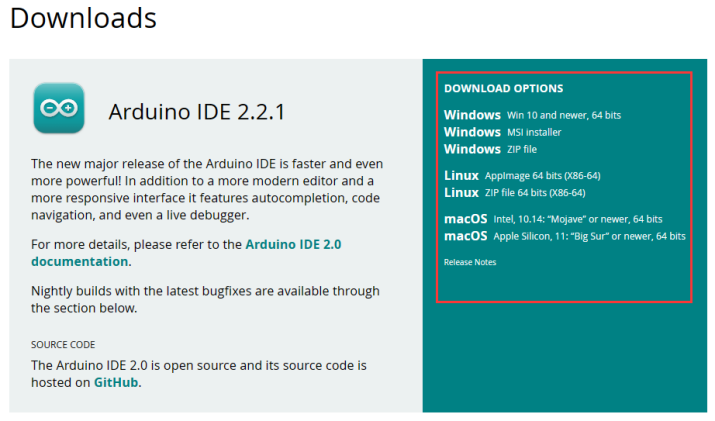

Step 2: Install CH340 Driver
----------------------------------------------
* If your computer can detect the USB-SERIAL CH340 port, it means the CH340 driver is already installed on your system, and you can skip this step directly.

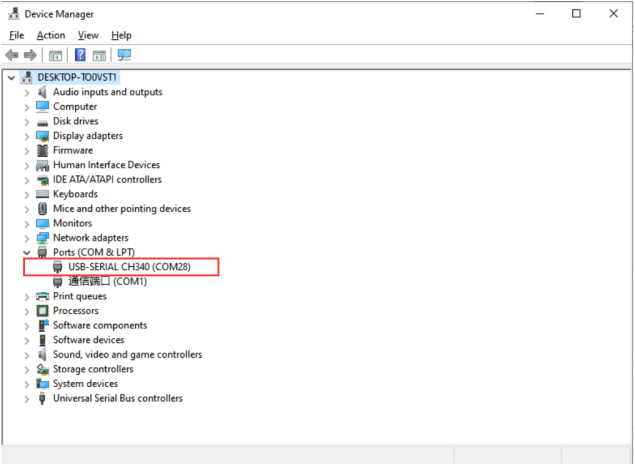

* If your computer does not automatically recognize the board(as shown in the picture), you may need to install the CH340 driver.

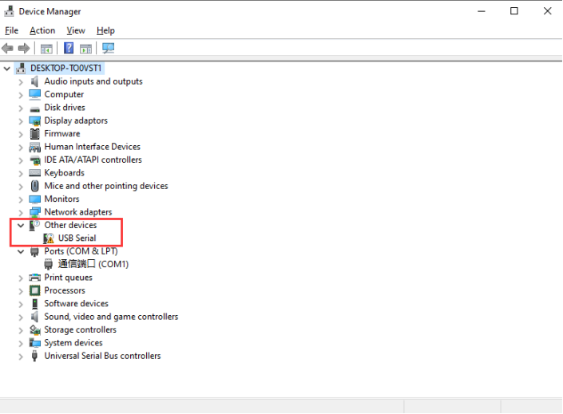

Follow the steps below to install the CH340 driver:

①: Downloading the driver

First, download the CH340 driver from the this link.
`Windows CH340 Driver <https://www.dropbox.com/scl/fi/m5ahy1flzm5znz2k2ikvl/CH341SER_Window.EXE?rlkey=vlzov8ojypglo46y3w6prcbyf&st=hltdfejq&dl=1>`_

You can also download the latest version of the driver directly from the `manufacturer’s site <https://www.chipchips.com/CH340.html>`_

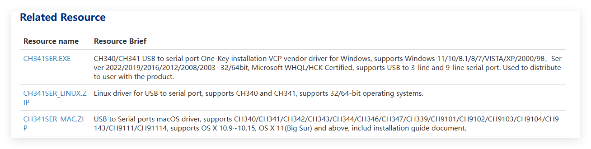

②: Installing the driver

After downloading the driver, open it and click Install.

.. note::
   Tip: Before installing the driver software, you must connect the Arduino board to your computer with a USB cable.

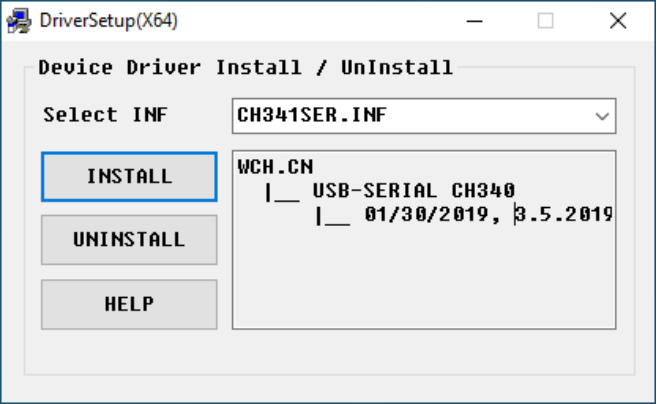

After successful installation you should see this message

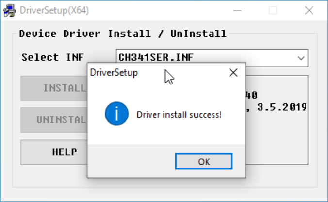

Note：In some cases, you may need to reset Windows after the driver installation is complete.

③: Checking Correct Driver Installation in Device Manager

If your driver has been installed correctly, and you connect your board to your computer, you will see its name and port number listed in the Ports section of Device Manager. For example, your Arduino board may show up as connected to **COM28**.

④: Verify Installation in the Arduino IDE
  
Open the Arduino IDE -> **Tools** -> **Port** -> **COM28**. This ensures the IDE communicates with your Arduino board correctly.

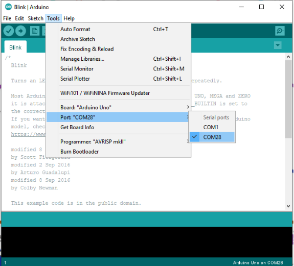

If you can't find the CH340 device in Device Manager or Arduino IDE, the driver installation failed. Try uninstalling the driver, restarting your computer, and repeating the steps above.

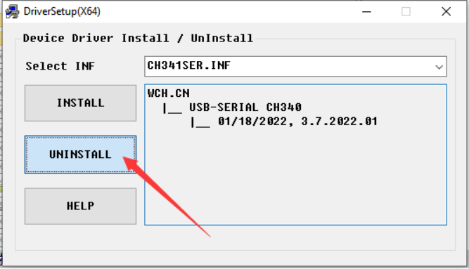

Step 3: Add Arduino Library
----------------------------------------------

* Before uploading the Arduino UNO code, please make sure the required Arduino libraries have been installed in the Arduino IDE.
* This project requires the installation of **“FastLED“** library **"version 3.5.0"** and **Servo** library **version 1.3.0**. 

install them first through **Sketch** -> **Include Library** -> **Manage Libraries...**

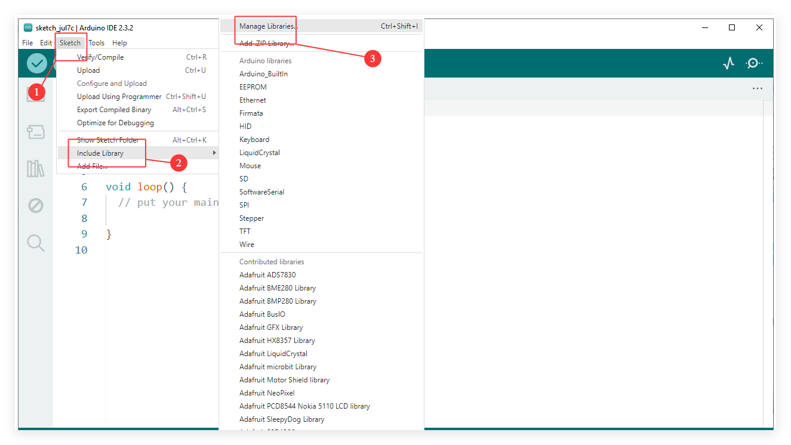

Search for **"FastLED"**, select version 3.5.0, and click install. If you have already installed it, click to update to version **3.5.0.0**.

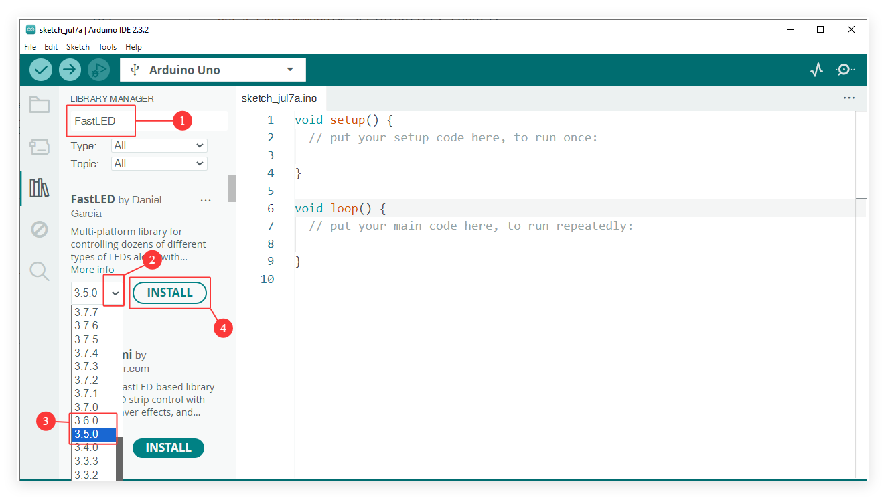

After successful installation, the library will appear in the Library Manager of the Arduino IDE.

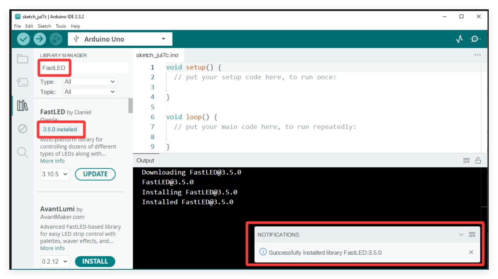

Search for **"Servo"**, select version 1.3.0, and click install. If you have already installed it, click to update to version **1.3.0**.

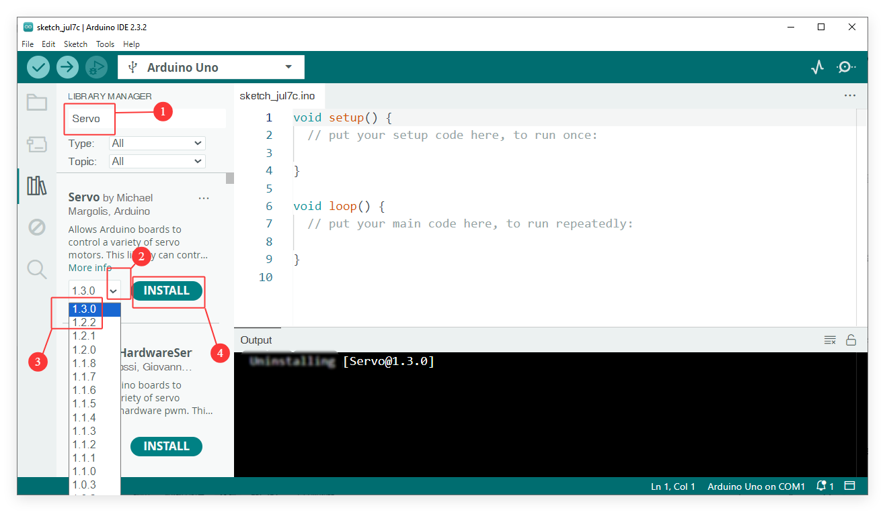

After successful installation, the library will appear in the Library Manager of the Arduino IDE.

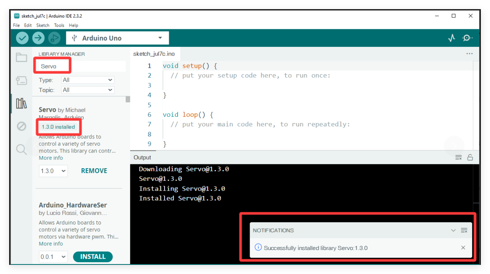

Step 4: Upload Arduino UNO Main Code
----------------------------------------------

① Load Main code into the Arduino IDE

* Launch the Arduino IDE and navigate to **File** -> **Open...** in the menu bar, then locate and select the main program **`SmartRobotCar_Main_V1.ino`** from your downloaded resource folder. `Download Main Code <../_static/Main_Code_Arduino_UNO.zip>`_

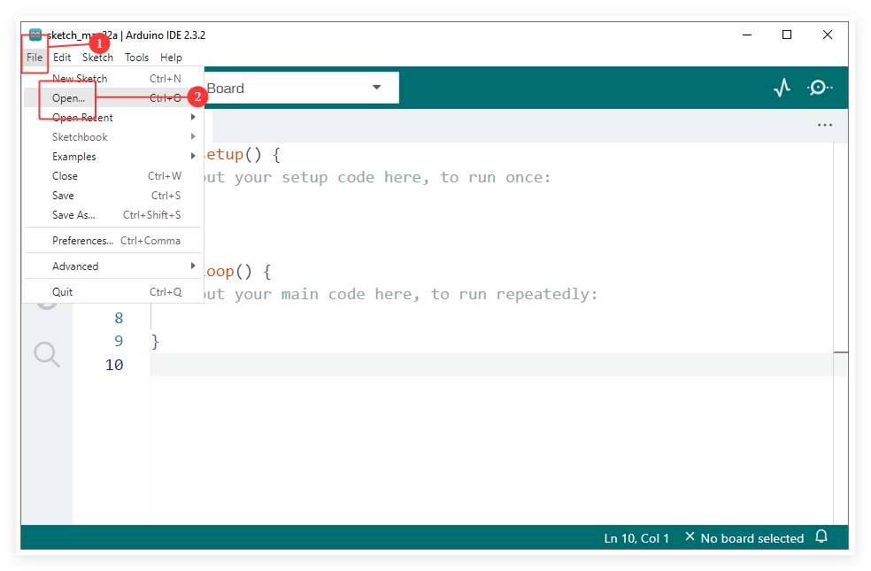

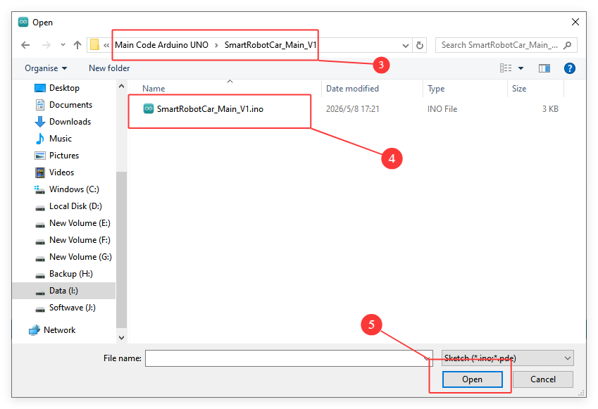

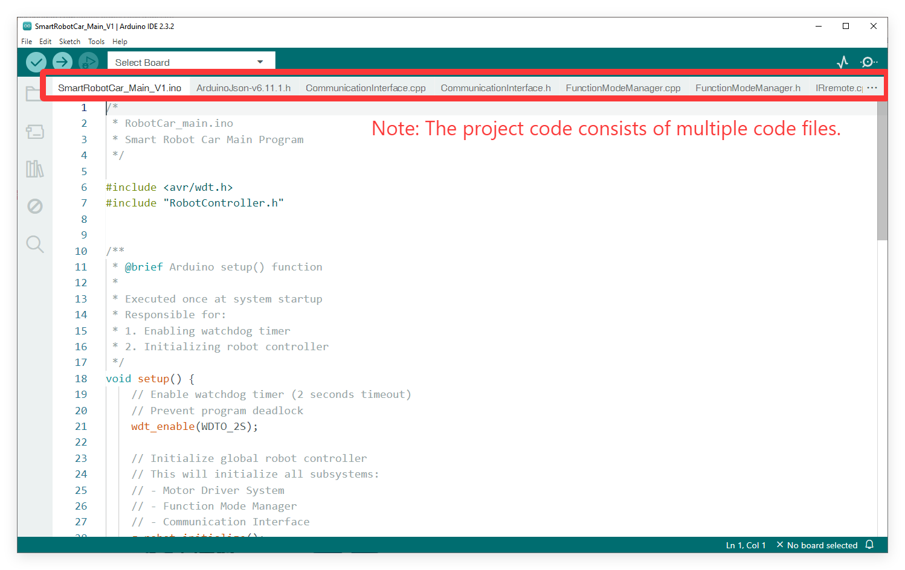

② Connect the Arduino UNO Board to Your Computer

* Connect the Arduino UNO Board on the Smart Robot Car to your computer using the provided USB Type B cable.
* Ensure the power switch on the Smart Robot Car is turned on.

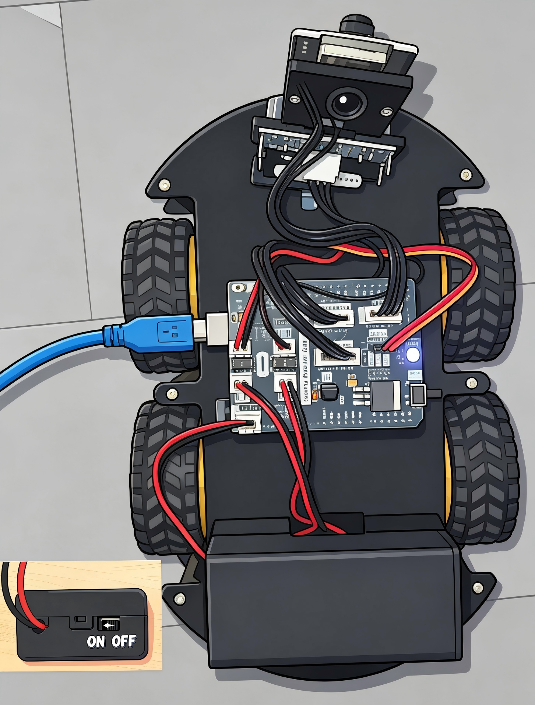

③ Configure the Board and Port

* Go to **Tools** -> **Board** and select **Arduino Uno**.
* Go to **Tools** -> **Port** and select the COM port that corresponds to your connected Arduino board.

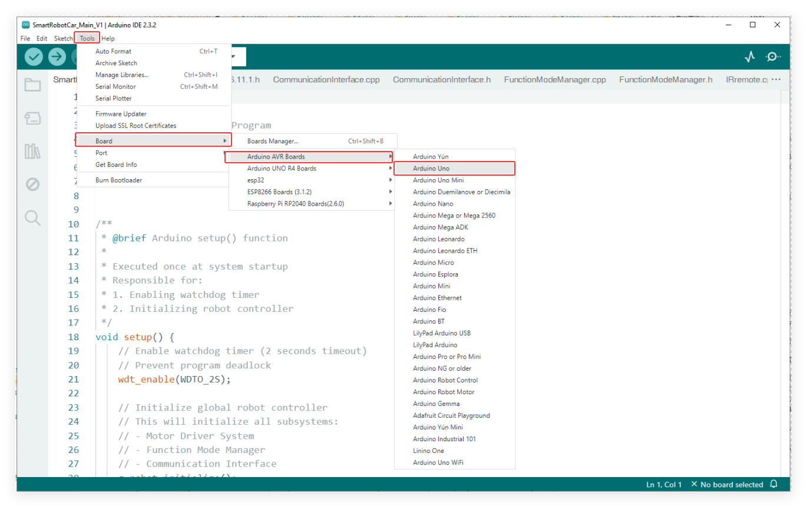

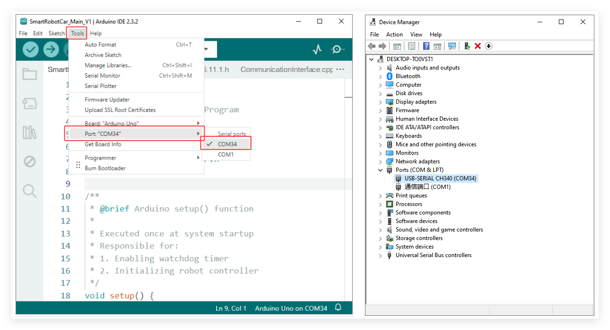

④ Upload the Code

* Click the **Upload** button (the right-pointing arrow icon) located in the top-left corner of the Arduino IDE.
* Wait for the IDE to compile and upload the sketch.
* You should see a "Done uploading" message at the bottom of the IDE window when it is successful.

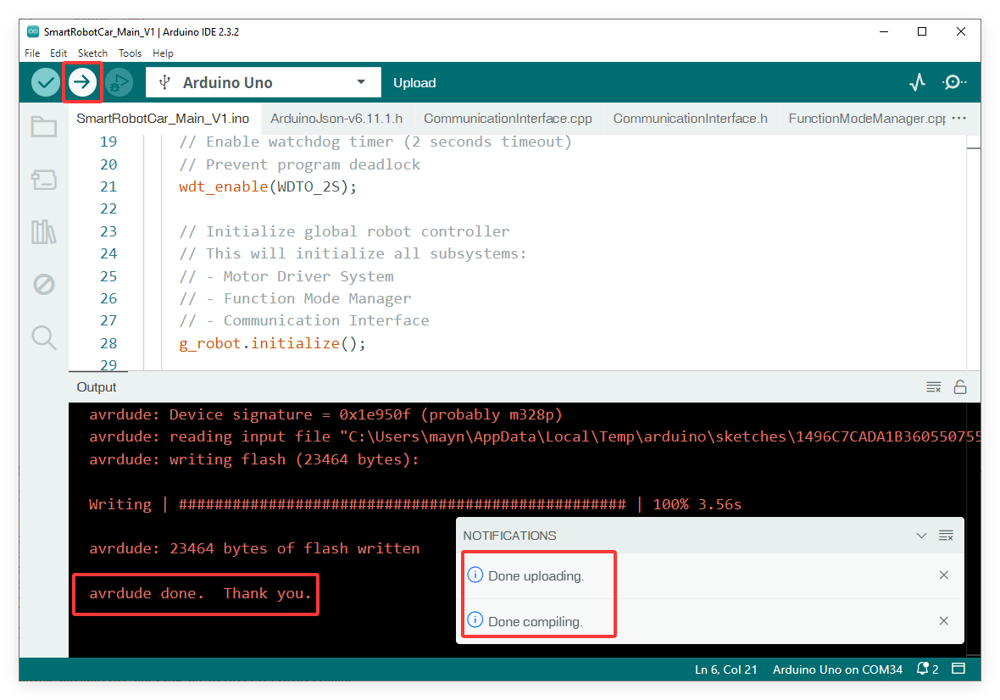
