Upload Program to ESP32 Camera
=====================================

This section provides detailed instructions on how to upload the program to the ESP32 S3 Camera Module.

There are two methods to upload code to the ESP32 S3 Camera Module:

Option 1: Using the Arduino IDE
----------------------------------------------

Step 1: Install Arduino IDE
~~~~~~~~~~~~~~~~~~

Go to https://www.arduino.cc/en/Main/Software and you will see the following page.

The version available at this website is usually the latest version, and the actual version may be newer than the version in the picture. 

If you have already installed the Arduino IDE, you can skip this step and continue to the next step.

.. image:: ../_static/P1.png
   :alt: Arduino IDE Download Page
   :width: 600px
   :height: 400px 
   :align: center

.. _esp32-ch340-driver:

Step 2: Install CH340 Driver
~~~~~~~~~~~~~~~~~~
* If your computer can detect the **USB-SERIAL CH340 (COMx)** port, it means the CH340 driver is already installed on your system, and you can skip this step directly.

.. image:: ../_static/P5.png
   :alt: CH340 Driver Download Page
   :width: 80%
   :align: center

* If your computer does not automatically recognize the board(as shown in the picture), you may need to install the CH340 driver.

.. image:: ../_static/P2.png
   :alt: CH340 Driver Download Page
   :width: 80%
   :align: center

Follow the steps below to install the CH340 driver:

①: Downloading the driver

First, download the CH340 driver from the this link.
`Windows CH340 Driver <https://www.dropbox.com/scl/fi/m5ahy1flzm5znz2k2ikvl/CH341SER_Window.EXE?rlkey=vlzov8ojypglo46y3w6prcbyf&st=hltdfejq&dl=1>`_

You can also download the latest version of the driver directly from the `manufacturer’s site <https://www.chipchips.com/CH340.html>`_

.. image:: ../_static/P3.png
   :alt: CH340 Driver Download Page
   :width: 80%
   :align: center

②: Installing the driver

After downloading the driver, open it and click Install.

.. note::
   Tip: Before installing the driver software, you must connect the Arduino board to your computer with a USB cable.

.. image:: ../_static/P4.png
   :alt: CH340 Driver Installation Page   
   :width: 80%
   :align: center

After successful installation you should see this message

.. image:: ../_static/P6.png
   :alt: CH340 Driver Installation Page   
   :width: 80%
   :align: center

Note：In some cases, you may need to reset Windows after the driver installation is complete.

③: Checking Correct Driver Installation in Device Manager

If your driver has been installed correctly, and you connect your board to your computer, you will see its name and port number listed in the Ports section of Device Manager. For example, your Arduino board may show up as connected to **COM28**.

.. image:: ../_static/P5.png
   :alt: CH340 Driver Installation Page   
   :width: 80%
   :align: center

④: Verify Installation in the Arduino IDE
  
Open the Arduino IDE -> **Tools** -> **Port** -> **COM28**. This ensures the IDE communicates with your Arduino board correctly.

.. image:: ../_static/P7.png
   :alt: Arduino IDE Port Selection Page   
   :width: 80%
   :align: center 

If you can't find the CH340 device in Device Manager or Arduino IDE, the driver installation failed. Try uninstalling the driver, restarting your computer, and repeating the steps above.

.. image:: ../_static/P8.png
   :alt: Arduino IDE Port Selection Page   
   :width: 80%
   :align: center 

Step 3: Install ESP32 Core Board Package
~~~~~~~~~~~~~~~~~~

Add Additional Boards Manager URL

1. Open the Arduino IDE, click **File → Preferences** in the upper left corner, and copy and paste the following address into the *Additional Board Manager URLs* input box.  

2. After entering the URL, click **OK**.  

.. raw:: html

   

     <code id="esp32-url" style="background:#f5f5f5;padding:6px 10px;border:1px solid #ddd;border-radius:6px;">https://espressif.github.io/arduino-esp32/package_esp32_index_cn.json</code>
     <button onclick="navigator.clipboard.writeText(document.getElementById('esp32-url').innerText)" style="padding:4px 8px;background:#007bff;color:#fff;border:none;border-radius:4px;cursor:pointer;"> Copy</button>
   

.. raw:: html

   

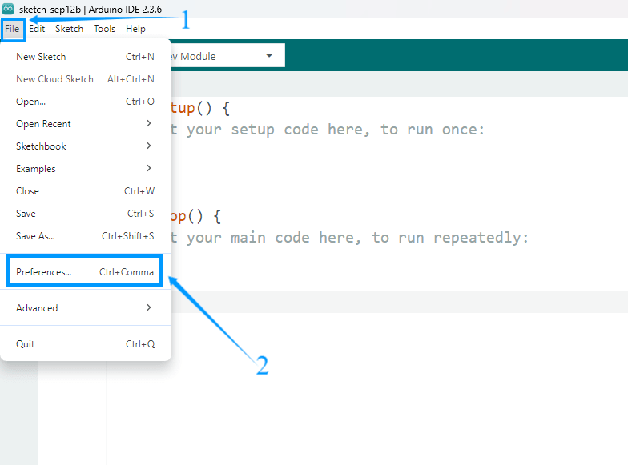

.. raw:: html

   

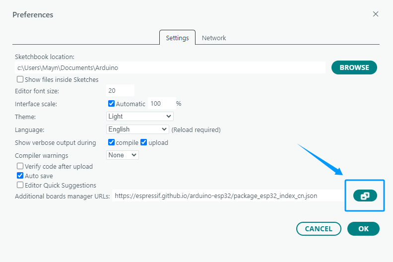

.. raw:: html

   

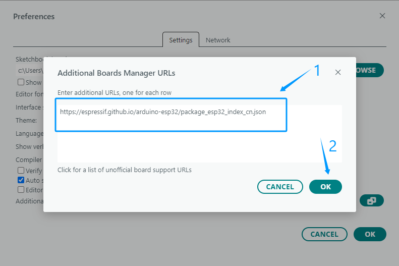

.. raw:: html

   

.. admonition:: Precaution
   :class: note

   - After completing this step, you need to close and reopen the Arduino IDE.

Download the  ESP32 Core Package 

1. Open the Arduino IDE, click the second icon on the left to open the **BOARDS MANAGER** page.  

2. Enter **ESP32** in the search box and press Enter.  

3. Find the core package titled *esp32 by Espressif Systems*, select version **3.3.8** from the drop-down menu, and click **Install** to download and install it.  
   
.. admonition:: 💡 Tip
   :class: tip

   If you have already installed another version, simply select version **3.3.8** and click the **Update** button.
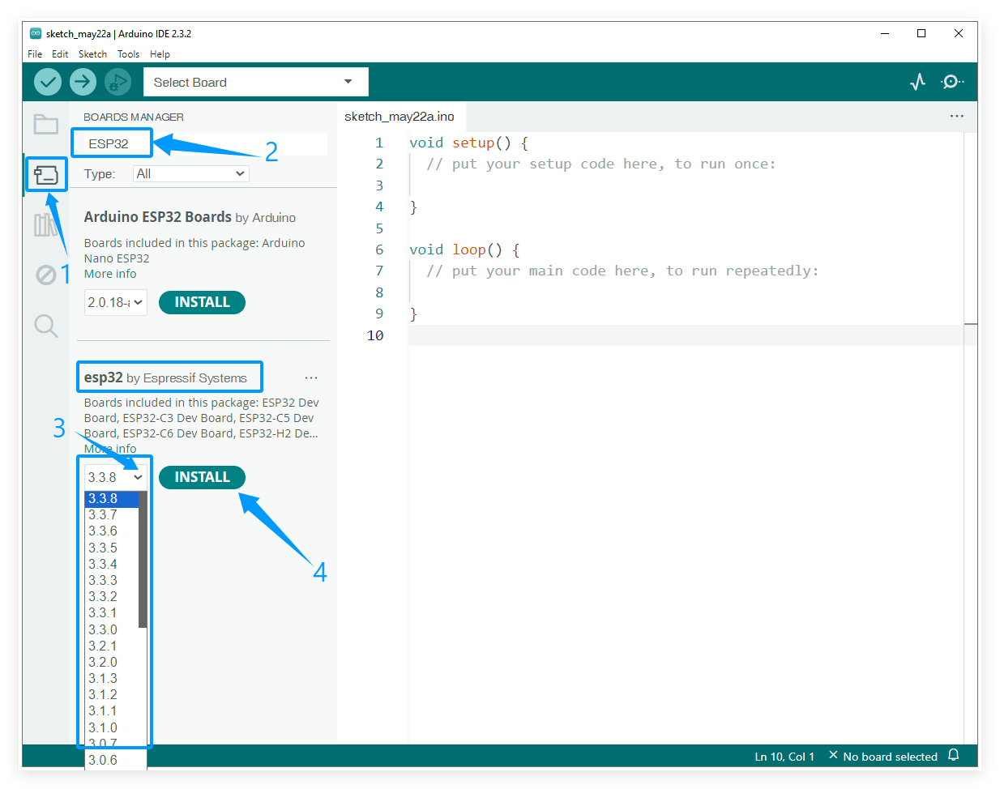

   :width: 600
   :align: center

.. raw:: html

   

4. Please wait for the download progress bar in the lower right corner to complete.  

.. raw:: html

   

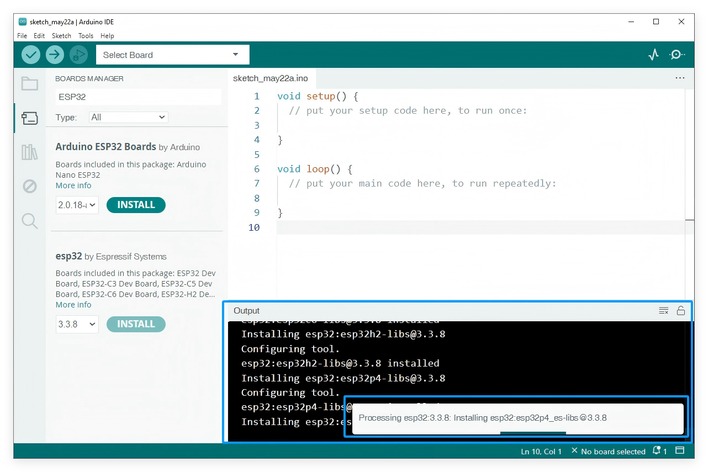

.. raw:: html

   

5. When the download is complete, the message **Successfully installed platform esp32:3.3.8** will be displayed.  

.. raw:: html

   

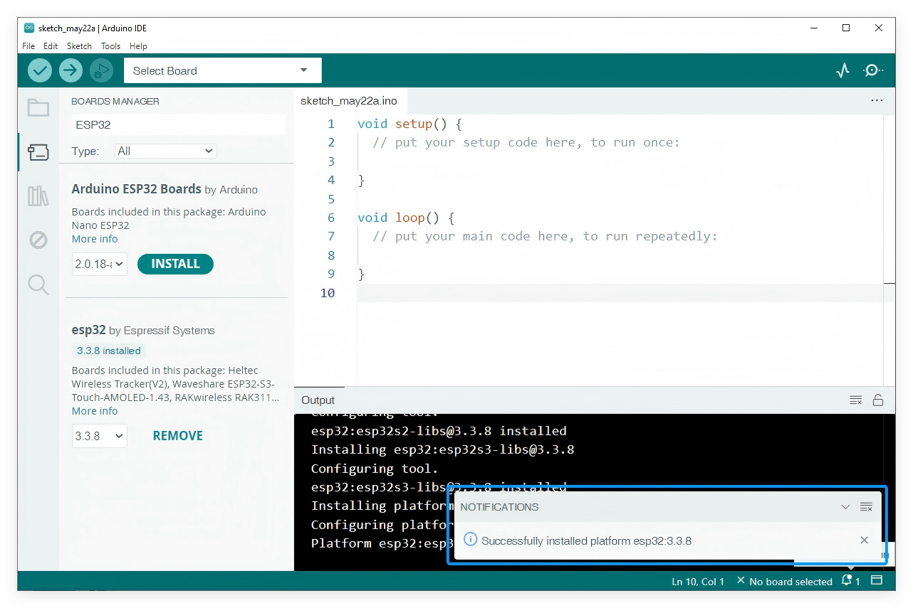

.. raw:: html

   

6. Check if the installation is successful:  
Click **Tools → Board → esp32** to check whether an ESP32 development board is available for selection.  

.. raw:: html

   

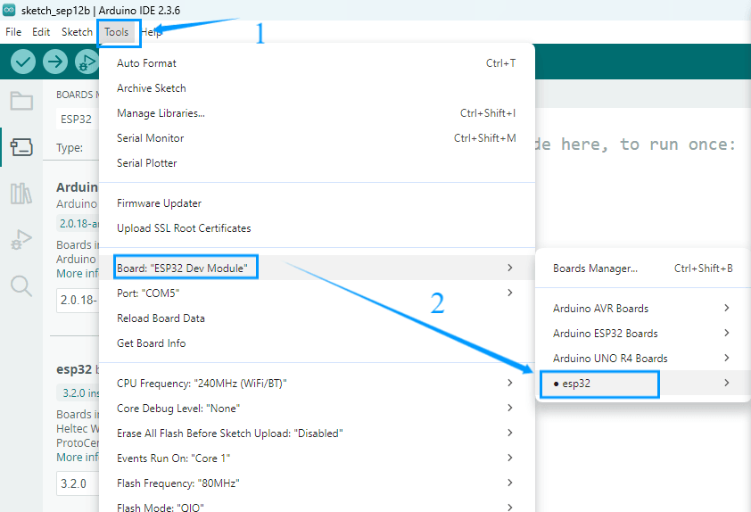

.. raw:: html

   

.. admonition:: Precaution
   :class: note

   - We recommend installing ESP32 Core Package version **3.3.8**, or using version **3.0 or later**.  
   - Older versions may be incompatible with the libraries used in this tutorial, causing program errors.  
   - If you have an earlier version installed, uninstall it and then reinstall version **3.3.8** of the ESP32 Core Package.  

Step 4: Upload ESP32-S3 Main Code
~~~~~~~~~~~~~~~~~~

① Load Main code into the Arduino IDE

* Launch the Arduino IDE and navigate to **File** -> **Open...** in the menu bar, then locate and select the main program **`ESP32S3_Cam_Main_V1.ino`** from your downloaded resource folder.

.. image:: ../_static/P9.png  
   :alt: Arduino IDE Port Selection Page   
   :width: 80%
   :align: center 

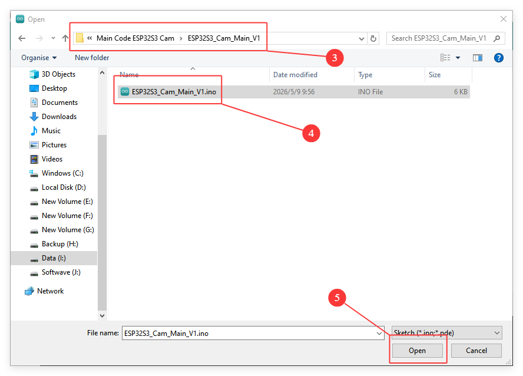

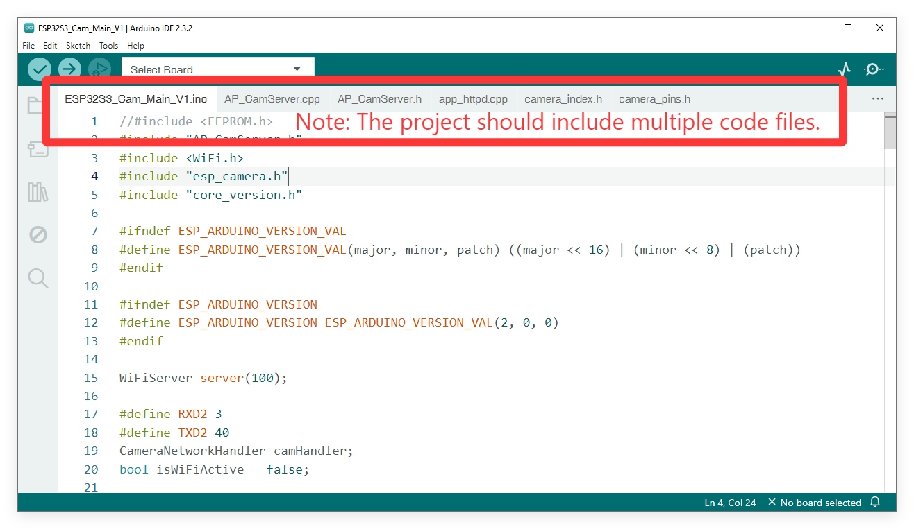

② Connect the ESP32 Camera Board to Your Computer

* Connect the ESP32 Camera Board on the Smart Robot Car to your computer using the provided USB Type C cable.

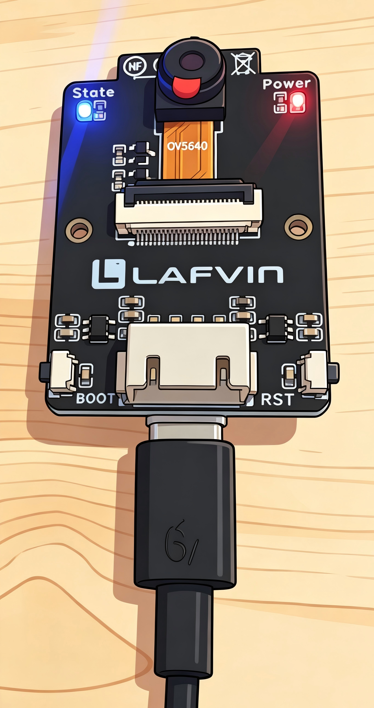

③ Configure the Board and Port

* Go to **Tools** -> **Board** -> **esp32**and select **ESP32S3 Dev Module**.
  
  .. image:: ../_static/P19.png       
   :alt: Arduino IDE Port Selection Page   
   :width: 100%
   :align: center 
* Go to **Tools** -> **Port** and select the COM port that corresponds to your connected ESP32S3 Camera. 
  
  .. note::
     You can check the COM port number in Device Manager. For example, the COM port number of the ESP32S3 camera on my computer is COM34, and your port number may be different.

.. image:: ../_static/P13.png       
   :alt: Arduino IDE Port Selection Page   
   :width: 100%
   :align: center 

* Go to **Tools** to configure all important settings
.. admonition:: Required Board Configuration
   :class: note

   * **Board** ---> ESP32S3 Dev Module
   * **Flash Size** ---> 8MB(64Mb)
   * **Partition Scheme** ---> 8M with spiffs (3MB APP/1.5MB SPIFFS)
   * **Flash Mode** ---> QIO 80MHz
   * **PSRAM** ---> OPI PSRAM
   * **Upload Speed** ---> 921600

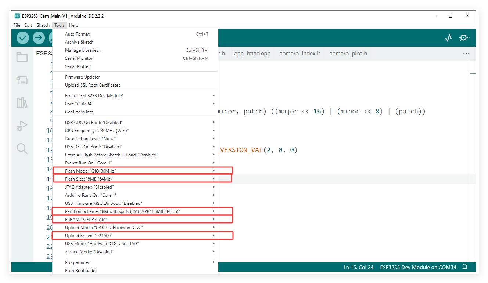

④ Upload the Code

* Click the **Upload** button (the right-pointing arrow icon) located in the top-left corner of the Arduino IDE.
* Wait for the IDE to compile and upload the sketch.
* You should see a "Done uploading" message at the bottom of the IDE window when it is successful.

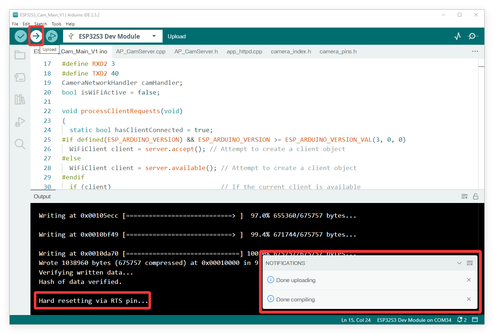

.. raw:: html

   

Option 2: Using the Flash Download Tool
----------------------------------------------

.. note::
   If you find the steps above too complex, or if you encounter unsolvable errors when flashing using the Arduino IDE, you can use Espressif's official flash tool instead. 
   We have packaged the complete program into a single **.bin** file, allowing you to directly flash the firmware to your ESP32 S3 camera module. This method eliminates the need to import libraries or download the ESP32 core package, enabling you to quickly complete the code upload process for the camera module.

Step 1: Prepare the Hardware
~~~~~~~~~~~~~~~~~~

* Connect the ESP32 S3 Camera Module to your computer using a USB Type-C cable.
* If the ESP32S3 camera module is connected to the Robot car shield at the same time, make sure that the power switch on the shield is turned on.

Step 2: Install CH340 Driver
~~~~~~~~~~~~~~~~~~
* If your computer can detect the **USB-SERIAL CH340 (COMx)** port, it means the CH340 driver is already installed on your system, and you can skip this step directly.

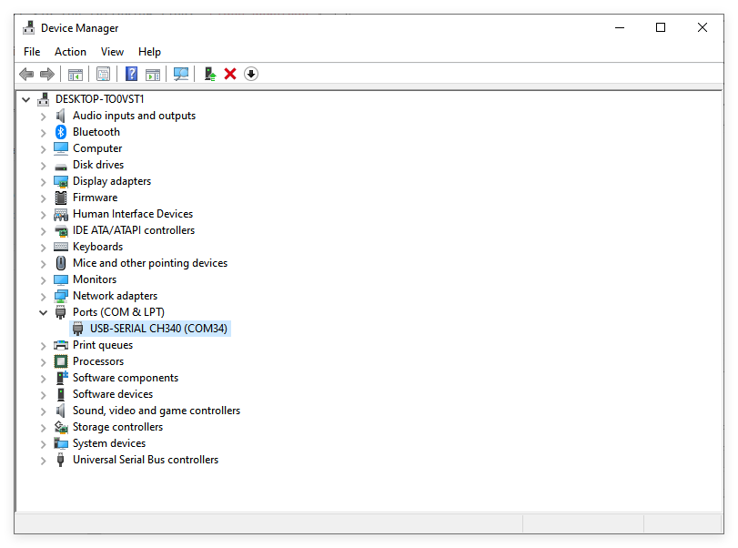

* If your computer does not automatically recognize the board(as shown in the picture), you may need to install the CH340 driver.

.. image:: ../_static/P2.png
   :alt: CH340 Driver Download Page
   :width: 80%
   :align: center
:ref:`How to install the CH340 driver <esp32-ch340-driver>`

step 3: Get flash download tool
~~~~~~~~~~~~~~~~~~
You can find **flash download tool** in the provided resource folder.

Alternatively, you can download it via the following link: `Flash Download Tool <https://www.dropbox.com/scl/fo/zhqa14o10koosomheuftl/AOze5N8KQX_QKF8uSlPva0w?rlkey=0l20visrc62fjya5ik8opvfbb&st=c9xtsm2n&dl=1>`_

After extracting the file, you will get the executable **.exe** file.

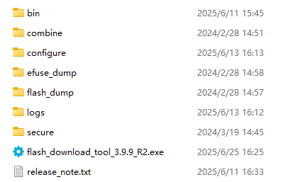

Step 4: Flash the .bin Firmware
~~~~~~~~~~~~~~~~~~
Launch the **flash_download_tool.exe**, then in the pop-up window, select the following options in order: 

* Chip Type → **ESP32-S3**, 
* Work Mode → **Develop**, 
* Load Mode → **UART**.

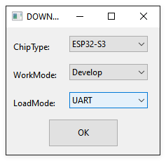

Set the flash tool parameters as follows:

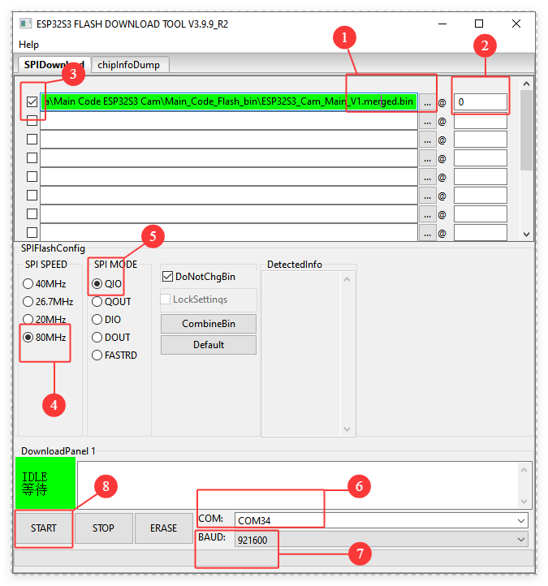

① Click the **...** button to select **ESP32S3_Cam_Main_V1.merged.bin** from the resource folder we provided. 
   
   Note: The file path must not be excessively long or contain special characters, as this will cause the upload to fail.

② Enter **0** as the memory address.

③ ☑️Check the box next to the file you want to upload. 

④ **SPI SPEED:** 80MHz

⑤ **SPI MODE:** QIO

⑥ **COM:** Select the COM port corresponding to your ESP32 S3 module.
   
   Note: You can check the COM port number in Device Manager. 

⑦ **BAUD:** 921600 

⑧ Click the **START** button to start the upload.

Please wait patiently. When the upload is successful, **FINISH** will be displayed.

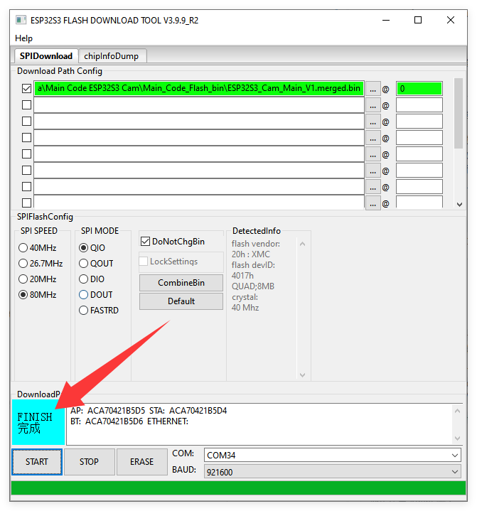

.. note::
   * If the upload fails, please check your USB cable, verify the COM port, and ensure no other program (like the Arduino IDE Serial Monitor) is currently using the port.

Step 5: Reset the Module
~~~~~~~~~~~~~~~~~~
* Press the **RST** (Reset) button on the ESP32 S3 Camera Module. The blue state LED will blink, indicating that the camera's Wi-Fi is now in a connectable state.

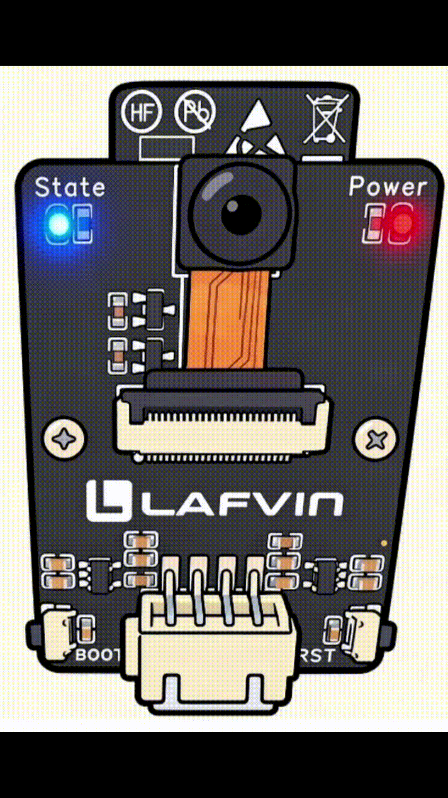

.. note::
   * If the blue State LED does not blink, check if the camera is installed correctly.

